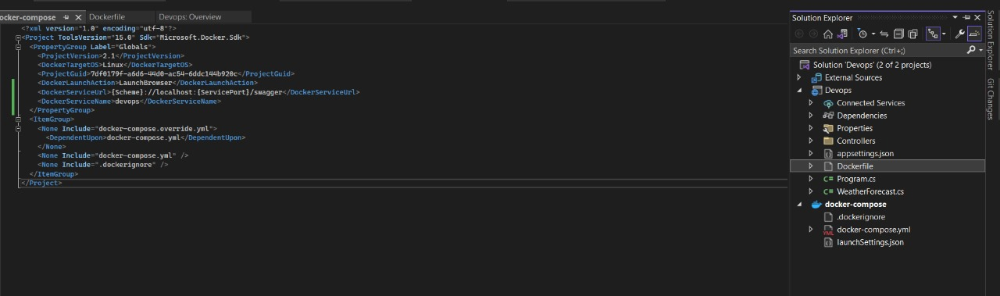
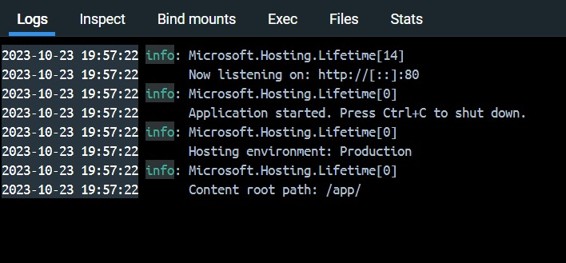
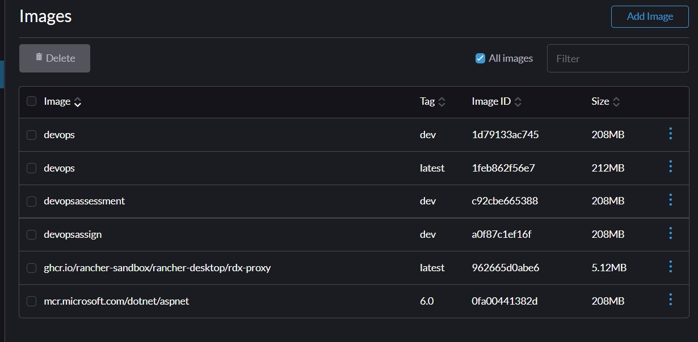
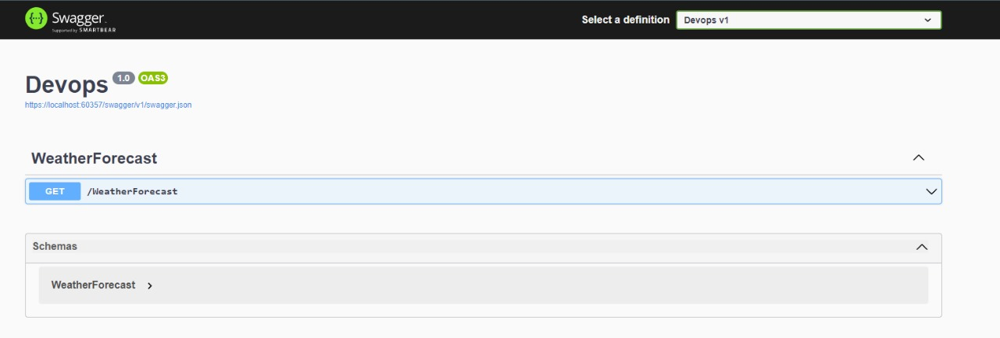

Final Assessment  - DevOps

Solution

MCQ:

1. What does WSL stand for in the context of Windows?

Answer: c. Windows Subsystem for Linux

1. What is the primary goal of continuous integration (CI) in DevOps?

Answer: b. Frequent integration of code changes

1. In the Linux command line, what does the cd command do?

Answer: b. Change the working directory

1. Which of the following is not a Linux distribution?

Answer: c. Docker

1. What is Docker primarily used for in DevOps and containerization?

Answer: c. Packaging and deploying applications in containers

1. What is the primary purpose of Azure DevOps?

Answer: b. Software development and delivery

1. Which components are part of Azure DevOps?

Answer: c. Azure Boards and Azure Pipelines

1. How does Azure DevOps support version control in software development?

Answer: b. It tracks changes in source code and manages versions.

1. In Linux, what is the primary role of the root user?

Answer: c. Administrative tasks with superuser privileges

1. In Azure DevOps, which component is used to define, build, test, and deploy applications?

Answer: c. Azure Pipelines

Labs:

Lab 1: File and Directory Management

Objective: Practice basic file and directory management commands.

Tasks:

1. Create a directory called “lab1” in your home directory.

1. Inside “lab1” create a text file named “sample.txt” with some content.

1. Make a copy of “sample.txt” and name it “sample\_copy.txt”.

1. Rename “sample\_copy.txt” to “new\_sample.txt”.

![ref1]

1. List the files in the “lab1”  directory to confirm their names.

![ref1]

Lab 2: Permissions and Ownership

Objective: Understand and manage file permissions and ownership.

` `Tasks:

1. Create a new file named "secret.txt" in the “lab2” directory.

![ref2]

1. Set the file permissions to allow read and write access only to the

owner.

![ref2]

1. Change the owner of "secret.txt"  to another user.

![ref3]

1. Verify the new permissions and owner using the ls -l and ls -n

commands.

![ref3]

Lab 3: Text Processing with Command Line Tools

Objective: Practice text processing using command-line tools.

Tasks:

1. Create a text file with some random text in the “lab3”  directory.

![ref4]

`    `2. Use the grep command to search for a specific word or pattern in the

file.

![ref4]

3\. Use the sed command to replace a word or phrase with another in the

file.

4\. Use the wc command to count the number of lines, words, and

characters in the file.

Lab 4: Creating a Simple YAML File

Objective: Create a basic YAML configuration file.

Task:

1\. Create a YAML file named “config.yaml”.

2\. Define key-value pairs in YAML for a fictitious application, including

name, version, and description.

3\. Save the file.

4\. Validate that the YAML file is correctly formatted.

Lab 5: Working with Lists in YAML

Objective: Practice working with lists (arrays) in YAML.

Task:

1\. Create a YAML file named “fruits.yaml”.

2\. Define a list of your favorite fruits using YAML syntax.

3\. Add items from the list.

![ref5]

4. Save and validate the YAML file.

![ref5]

Lab 6: Nested Structures in YAML

` `Objective: Explore nested structures within YAML.

` `Task:

1\. Create a YAML file named “data.yaml”.

2\. Define a nested structure representing a fictitious organization with

departments and employees.

3\. Use YAML syntax to add, update, or remove data within the nested

structure.

4. Save and validate the YAML file.

Lab 7: Create Classic Azure CI Pipeline for Angular Application

` `Objective: Set up a classic Azure CI pipeline to build a simple Angular

application with unit testing using Jasmine and Karma.

·Tasks:

1\. Create an Azure DevOps project.

2\. Set up a classic CI pipeline to build an Angular application.

3\. Configure the pipeline to use Jasmine and Karma for unit testing.

4\. Run the pipeline and validate the test results.

Lab 8: Create YAML Azure CI Pipeline for React Application

Objective: Create a YAML-based Azure CI pipeline to build a simple React

application with unit testing using Enzyme and Jest.

Tasks:

1\. Create an Azure DevOps project.

2\. Create a YAML-based CI pipeline to build a React application.

3\. Configure the pipeline to use Enzyme and Jest for unit testing.

4\. Trigger the pipeline and verify the test results.

Lab 9: Create CI Pipeline for .NET Core Application with MS Unit Test

Objective: Create a CI pipeline, either classic or YAML, to build a .NET Core

application and run MS Unit tests.

Tasks:

1\. Set up a new Azure DevOps project.

2\. Create a CI/CD pipeline for a .NET Core application.

3\. Configure the pipeline to use MS Unit tests.

4\. Trigger the pipeline and validate the test results.

Lab 10: Creating a Docker Image for a .NET Core Web API and Running it in Rancher

Desktop

Objective: In this lab, you will create a Docker image for a sample .NET Core Web

API application and then run the Web API container in Rancher Desktop.

Prerequisites:

Rancher Desktop installed and running.

.NET Core SDK installed on your machine.

Tasks

Step 1: Create a .NET Core Web API Project

Step 2: Build the .NET Core Web API Project

Step 3: Dockerize the .NET Core Web API

Step 4: Build the Docker Image

Step 5: Run the Docker Container in Rancher Desktop

Step 6: Test the .NET Core Web API via swagger

